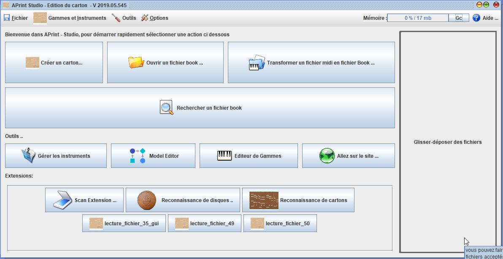

# APrint Studio Project

*Barrel organ discovery - 2004-2020*

CI 2020 q2 : 

This repository contains the **full source** of APrint Studio, more informations can be found on the web site : [http://www.barrel-organ-discovery.org](http://www.barrel-organ-discovery.org)  





APrint Studio is composed of a constellation of **tools** for creating **mechanical books** , for **street organs**, **fair organs**, **musicbox** .. 

### Discussions / Forum

for issues, improvements, this github repository is the right place. 
for discussions use freddy's forum, [https://orguedebarbarie.vraiforum.com/](https://orguedebarbarie.vraiforum.com/)


### How to Build main project

For building the project, **Java 8** **SDK is needed**. (meaning the Java 8 JDK), this can be downloaded from Oracle Download Center, or you can download the aprint build version [here](http://www.barrel-organ-discovery.org/builds/jdk1.8.0_25_x64.zip)


from the root folder, launch :

```
gradlew createAllJars
```

compilation results will be located in bundle\build
extensions (that are installed in the personal home folder) are generated in bundle\offlineinstall-extensions 


### Running the project from command line

```
java -Xmx2g -server -Dmainfolder="C:\Users\use\Documents\.." -cp aprint.jar org.barrelorgandiscovery.gui.aprintng.APrintApplicationBootStrap
```


### Building the windows installer (only on windows platefoms)

Windows installer is available, using the NSIS project, **NSIS** must be installed to create the windows installer.

for creating the Installer with updated extensions launch the following command :

```
gradlew createAllInstaller
```

### for DEVS : Launch automatic tests and global test report

```
gradlew check testReport jacocoTestReport
```

