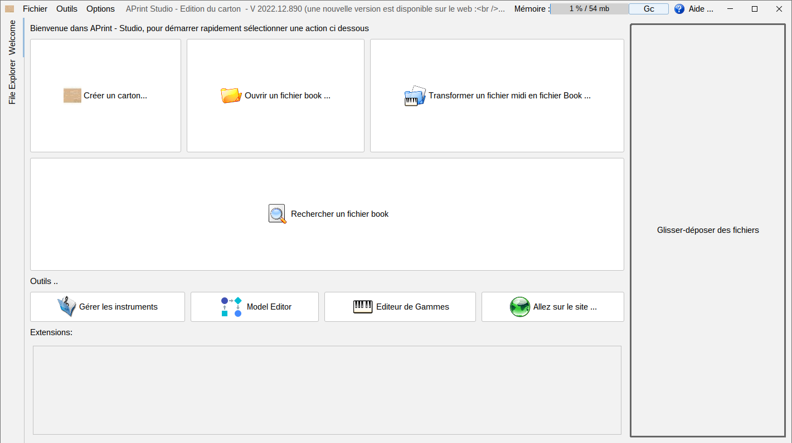

# APrint Studio Project

*Barrel organ discovery - 2004-2023*

This repository contains the latest **full source** of APrint Studio, more informations can be found on the web site : [http://www.barrel-organ-discovery.org](http://www.barrel-organ-discovery.org)  





APrint Studio is composed of a constellation of **tools** for creating **mechanical books** , for **street organs**, **fair organs**, **musicbox** .. 

### Discussions / Forum

for issues, improvements, this github repository is the right place. 
for discussions use freddy's forum, [https://orguedebarbarie.vraiforum.com/](https://orguedebarbarie.vraiforum.com/)


### How to Build main project

Note on 2022 version, this version switch to 13 to 17 java version mainly. This java version can be downloaded from Oracle Download Center or adoptjdk website.
The binaries are now provided on the github website, and everybody is able to build the app-image. The adoptjdk 17 is needed.


#### Building the app image


for creating the Installer with updated extensions launch the following command :

```
gradlew createjpackage
```

building only the jars (speed up the update, instead of the full 1gb all extension bundle):
```
gradlew createMacOsAndLinuxBundle
```

#### Running the project from command line


```
java -Xmx2g -server -Dmainfolder="C:\Users\use\Documents\.." -cp aprint.jar org.barrelorgandiscovery.gui.aprintng.APrintApplicationBootStrap
```

see documentation for more information about the command line parameters

#### for DEVS : Launch automatic tests and global test report

```
gradlew check testReport jacocoTestReport
```

