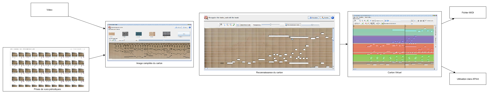
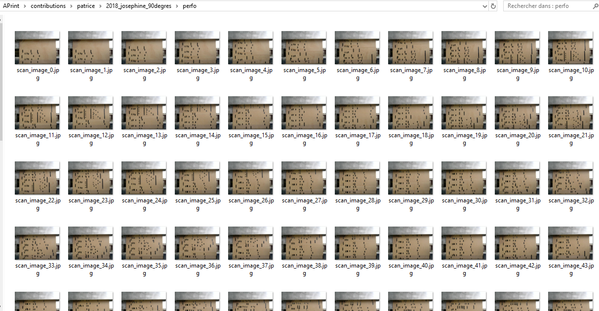
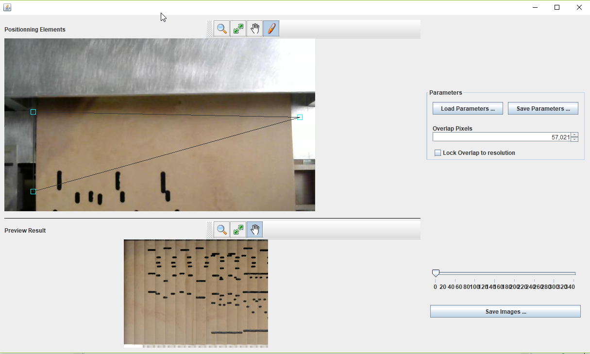
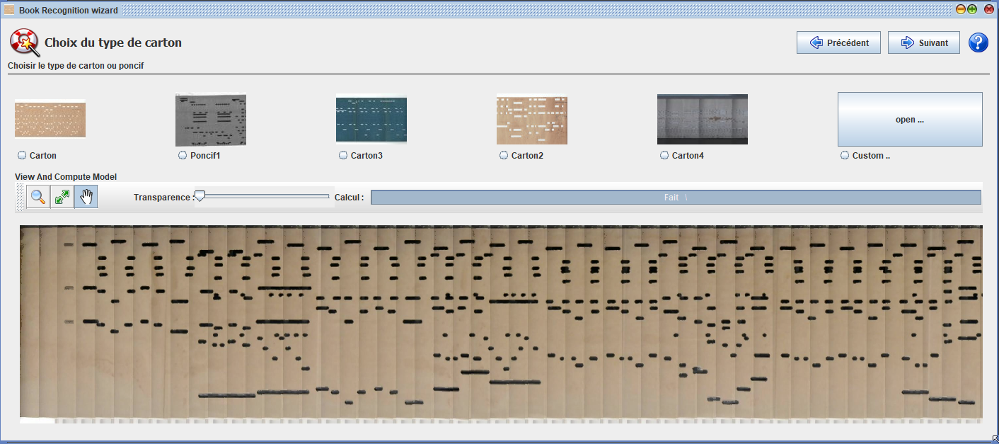
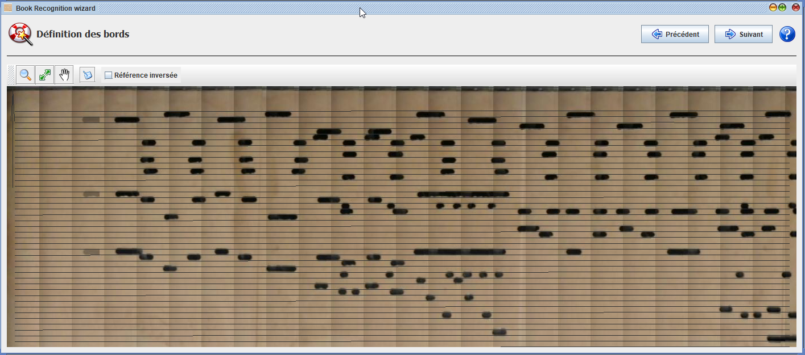
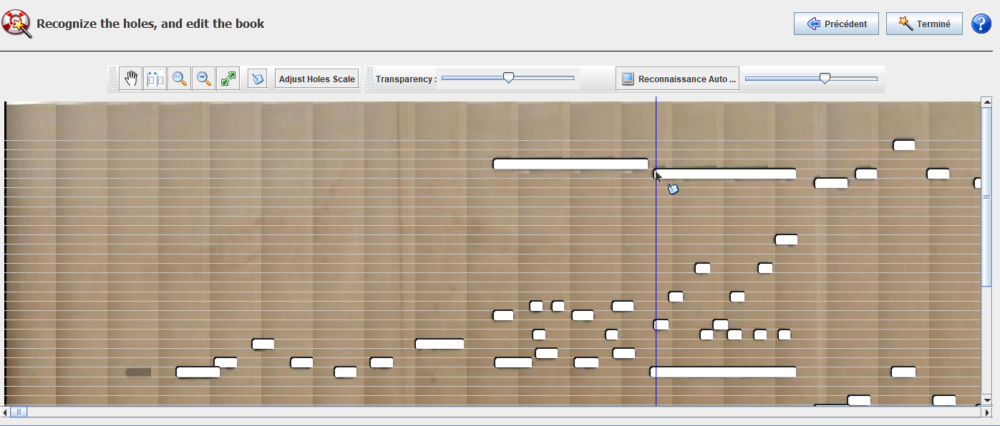
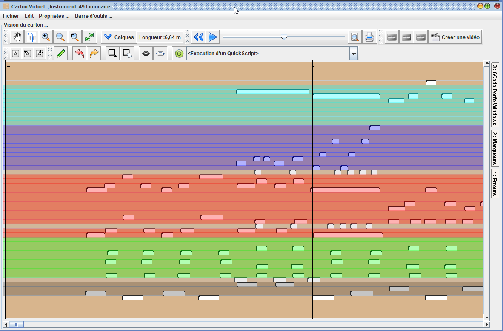

# Numérisation de carton

*Patrice Freydiere - Aout 2018*

APrint propose un ensemble d'outils logiciels pour effectuer des numérisations de cartons ou de poncifs à partir d'images. Cette approche permet d'être indépendante de la gamme de l'instrument, permet de corriger à toutes les étapes les réglages, et propose une numérisation sans erreurs, en utilisant les fonctions de retouche.

## Schéma général

La numérisation est effectuée avec des caméras, ou appareils photos. Plusieures possibilités sont envisageables pour l'acquisition du carton.

- Numérisation avec un appareil photo
- Numérisation avec une webcam (prises de vues périodiques)
- Numérisation avec une webcam + déclenchement à l'avance
- Numérisation avec un scanner

## Numérisation à partir d'une série de photos

Les prises de vues sont réalisée de façon périodique avec un avancement régulier, afin de limiter les traitements à réaliser, il est nécessaire que le carton soit bien positionné à plat.

Chaque photo est prise à intervalle régulier.

Dans le cas d'une video, il est possible d'extraire ces images en utilisant un outillage video.

## Conversion en une seule image

Les prises de vues sont ensuite converties en une seule image,  en utilisant l'outil de fusion. Celui ci combine les différentes photos, pour proposer la construction d'une image unique du carton.

L'outil de fusion prend en compte les paramètres suivants :

- positionnement de la fenetre de récupération de l'image du carton
- orientation de l'avancement
- paramètre de chevauchement du carton

les paramètres de reglage ont été limité pour permettre en un minimum de temps (quelques minutes), la construction d'une images comme proposée ci dessous :

## Reconnaissance et conversion en carton

Avec la reconstruction d'une image complète du carton, il est possible d'utiliser la fonction de  reconnaissance, permettant d'extraire les notes et pistes du carton, en fonction de l'instrument.

L'extraction automatique des notes permet de réduire le temps manuel de reprise. Des outils manuels permettent de retoucher la reconnaissance en ayant le carton numérisé sous jacent. Ainsi l'ensemble des ambiguïtés peuvent être résolues pour une bonne numérisation complète.

Le carton numérisé, il est directement utilisable pour arrangement, transformations, ou autres étapes.

